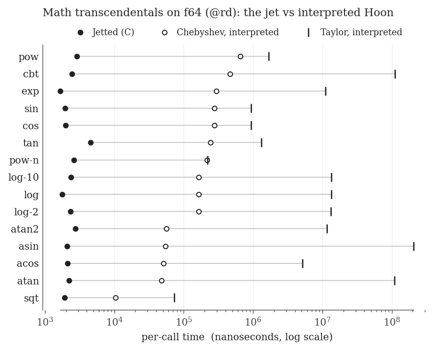
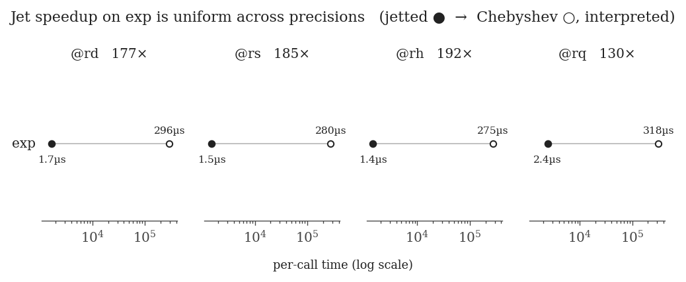
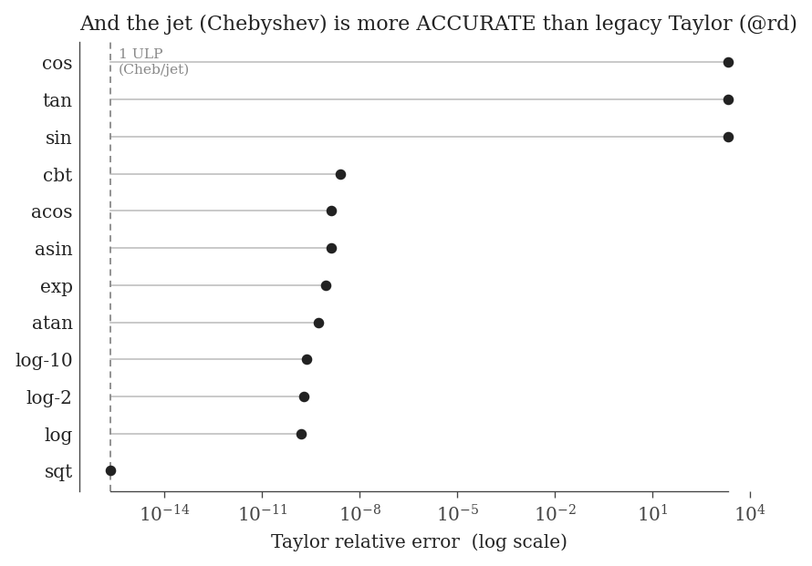

# Math transcendentals benchmark — 2026-06-26

Speed and accuracy of the `/lib/math` transcendentals across three implementations,
four IEEE precisions, and both runtime word sizes.

> **In one line:** the math jet is **130–200× faster than interpreted Chebyshev**,
> **38×–99,000× faster than the legacy Taylor**, and **more accurate** than Taylor —
> uniformly across f64/f32/f16/f128.

## Figures

*All 15 transcendentals on @rd (f64), log scale. Jetted (●) is uniformly ~2 µs;
interpreted Chebyshev (○) is 1–2 decades slower; Taylor (|) 2–5 decades slower, with
a wide per-arm spread (its iterative convergence is input-dependent).*

*The jet speedup on `exp` is essentially constant across precisions (177× / 185× /
192× / 130×) — f16 and f128 benefit as much as f64.*

*Accuracy: Taylor's relative error against the ≤1-ULP Chebyshev (= the jet). `sqt`
ties; most arms lose ~half the f64 digits (~1e-9); `sin`/`cos`/`tan` are catastrophic
(~10³ — no valid digits) from alternating-series cancellation.*

## Speed — @rd (f64), per-call ns, baseline-subtracted
| arm | jetted | cheb-interp | taylor | cheb× | taylor× |
|-----|-------:|------------:|-------:|------:|--------:|
| exp | 1.67 µs | 296 µs | 11.0 ms | 177× | 6,565× |
| log | 1.76 µs | 164 µs | 13.3 ms | 94× | 7,600× |
| sin | 1.95 µs | 278 µs | 0.94 ms | 143× | 480× |
| cos | 1.97 µs | 275 µs | 0.94 ms | 140× | 476× |
| tan | 4.53 µs | 241 µs | 1.30 ms | 53× | 288× |
| atan | 2.23 µs | 47.6 µs | 109 ms | 21× | 48,784× |
| atan2 | 2.72 µs | 56.2 µs | 11.5 ms | 21× | 4,237× |
| asin | 2.07 µs | 54.8 µs | 205 ms | 27× | 99,130× |
| acos | 2.10 µs | 51.2 µs | 5.17 ms | 24× | 2,459× |
| sqt | 1.92 µs | 10.3 µs | 73.5 µs | 5× | 38× |
| cbt | 2.44 µs | 467 µs | 111 ms | 192× | 45,723× |
| pow | 2.87 µs | 656 µs | 1.68 ms | 229× | 585× |
| pow-n | 2.62 µs | 217 µs | 219 µs | 83× | 83× |
| log-2 | 2.34 µs | 164 µs | 13.3 ms | 70× | 5,668× |
| log-10 | 2.38 µs | 165 µs | 13.4 ms | 69× | 5,638× |

`@rs` (f32) is consistent (exp 185×/4,574×, asin 17×/27,936×, sqt ~1×/35×).
`@rh`/`@rq` cheb-interp `exp`: 192× / 130× (see fig2).

## Findings
- **Word size is irrelevant.** @rd jetted/cheb/taylor are all ~1.0× between 32-bit
  and 64-bit — @rd is a 64-bit atom regardless of loom width; only pointer width differs.
- **All base ops are jetted** (`mul:rd/rs/rh/rq` ≈ 0.8–0.9 µs), so interpreted
  transcendentals are feasible for *every* precision.
- **The legacy Taylor is numerically broken for f16.** `exp` computes `xⁱ/i!`
  directly; `xⁱ` overflows f16 (`8⁶ > 65504`) before the series converges → the sum
  becomes `NaN` → the `|po−p| < rtol` convergence test (a NaN compare) never succeeds
  → ~88 M wasted iterations (the "70 s/call" we first saw). A *correctness* failure
  for `5 < |x| < 11`, not mere slowness — the range-reduced Chebyshev avoids it.

## Methodology
- **jetted**: `urbit-jet-32/64` (math C jet attaches), n=100k.
- **cheb-interp**: `urbit-nojet-32/64` (same `math.hoon` with hints, but NO math jet
  registered → clean interpreted Chebyshev on jetted SoftFloat base ops), n=10k.
  NB: do *not* interpret by commenting `~%` on the jet binary — that makes the runtime
  re-attempt the unparentable jet every call (`fund: parent not found` flood + skew).
- **taylor**: legacy iterative `Σxⁱ/i!` lib (bare door, never jetted), n=10 (slow).
- Inputs precomputed OUTSIDE `~>(%bout)` so the slow interpreted `sun:rd` isn't timed.
- 5 sets, set 0 dropped as warm-up; per-call = `(arm − base)/n`.
- Binaries: vere 4.4 (`b591168a6f` / `dc5ba310`), fresh hoon-136 fakezod on the
  downloaded `urbit-v4.4.pill`.  (Boot tip: vere's pill downloader hangs intermittently;
  `curl` the pill once and boot `-B`.)

## Coverage & files
- jetted: all 4 doors × 15 arms (32 & 64-bit).  cheb-interp: all 4 doors × 15 arms.
  taylor: @rd/@rs/@rq × 15 arms; @rh exp single-point (the bug above).
- `bench-timing-all.csv` — 1,520 rows (canonical).  `bench-summary-all.tsv` — mean±stddev.
- `bench-accuracy-rd.csv` — Taylor error per arm.  `bench-interp-exotic.csv` — @rh point.
- `figures/` — Tufte-style plots (PNG + PDF) + `figures/README.md`.
- `raw-*.txt` — raw dojo scrollback per phase (re-parse with `tools/parse_raw.py`).

Reproduce: `tools/bench_run.sh 32 ./bin/urbit-jet-32 results/<date>/bench-timing.csv`
then `tools/bench_summarize.py` and `tools/bench_plots.py`.
